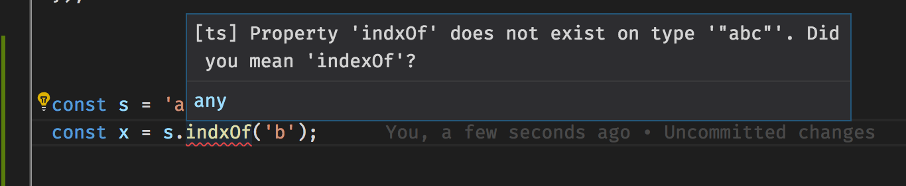
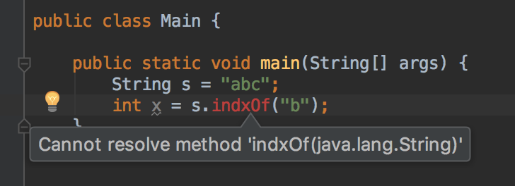

@title[Introduction]

## Unexpected Server Error! 
## See Admin2

#### APIs are User Interfaces, too!
 
 
Don't forget who your users are

---

@title[Intro2]

#### APIs are User Interfaces
- Sometimes that user is another developer
- Sometimes that user is yourself, 6 months from now
- That user likely has a different skill level than you do now

---

@title[FirstSteps]

#### Think about initial reactions by users
- Is it documented at all?
- Do you require seemingly-unnecessary data?
- Do you use **consistent** naming conventions?

 

#### What about things going wrong?
- Do you document how errors are returned?
- Do you use the accepted standards for your platform? (HTTP status codes, exit codes, etc)
- Are your error messages **helpful**?

Think back to your own frustrations

---

@title[WhatNext]

## How?
#### It's not much different than a GUI
- Try to explain your API to someone. Have them play dumb.
- If possible, ask someone to try and use it, WITHOUT your help
- Try to use your API yourself. (Eat your own dog food.)

---

#### Don't forget about failure scenarios
- Do some fuzz testing -- basically the equivalent of mashing the keyboard
- Try purposely doing things wrong, and see what the error messages are like
- Leave out required fields, make fields the wrong type, purposely misspell words

If you get unhelpful errors (or no errors at all), then you have work to do

Remember all the times you got unhelpful errors while coding!

---

@title[CompilerExamples]
#### Compilers are user interfaces too!
- You enter some text, they spit back any errors they encounter
- A good compiler will give you errors that are informative

